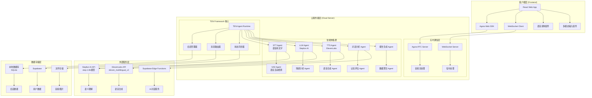

# MedJourney 多智能体协同架构图

## 系统架构概览



## 详细智能体架构

### 1. 核心智能体组件

#### 1.1 TEN Agent Runtime (主控制器)
```typescript
// 位置: medjourney-backend/src/services/ten-framework.ts
class TENFrameworkServiceImpl extends EventEmitter {
  private activeSessions: Map<string, any> = new Map();
  private stepfunService: any;
  private elevenLabsService: any;
  
  // 核心功能:
  // - 会话生命周期管理
  // - 消息路由和分发
  // - 状态同步和监控
  // - 错误处理和重连
}
```

#### 1.2 STT Agent (语音转文字)
```typescript
// 集成方式: 通过Web Speech API (前端) + 后端处理
// 功能: 实时语音识别，支持中文
// 配置: lang: 'zh-CN', continuous: true, interimResults: true
```

#### 1.3 LLM Agent (语义理解)
```typescript
// 位置: medjourney-backend/src/services/stepfun.ts
class StepfunAIServiceImpl {
  private model: string = 'step-1-8k';
  private baseURL: string = 'https://api.stepfun.com/v1';
  
  // 核心功能:
  // - 对话生成
  // - 情感分析
  // - 认知评估
  // - 医疗建议
}
```

#### 1.4 TTS Agent (语音合成)
```typescript
// 位置: medjourney-backend/src/services/elevenlabs.ts
class ElevenLabsServiceImpl {
  private modelId: string = 'eleven_multilingual_v2';
  private voiceId: string = '21m00Tcm4TlvDq8ikWAM';
  
  // 核心功能:
  // - 流式语音合成
  // - 多语言支持
  // - 情感语音调节
}
```

#### 1.5 对话分析 Agent
```typescript
// 位置: medjourney-backend/src/services/conversation-analyzer.ts
class ConversationAnalyzerImpl {
  // 核心功能:
  // - 情感趋势分析
  // - 认知功能评估
  // - 社交参与度分析
  // - 健康风险评估
}
```

### 2. 实时通信架构

#### 2.1 Agora 音频流处理
```typescript
// 配置信息:
const AGORA_CONFIG = {
  appId: 'd83b679bc7b3406c83f63864cb74aa99',
  channelName: `medjourney_${sessionId}`,
  uid: `user_${patientId}`
};

// 数据流:
用户语音 → Agora Web SDK → Agora SD-RTN™ → TEN Agent → STT处理
TTS输出 → TEN Agent → Agora SD-RTN™ → Agora Web SDK → 用户播放
```

#### 2.2 WebSocket 信令处理
```typescript
// 消息类型:
interface TENMessage {
  type: 'text' | 'audio' | 'image' | 'control';
  content: string | ArrayBuffer;
  sessionId: string;
  metadata?: Record<string, any>;
}

// 状态同步:
interface TENStatusUpdate {
  sessionId: string;
  status: 'idle' | 'listening' | 'processing' | 'speaking';
}
```

### 3. 智能体协作流程

#### 3.1 实时语音对话流程
```
1. 用户开始说话
   ↓
2. VAD Agent 检测语音活动
   ↓
3. STT Agent 实时转换语音为文字
   ↓
4. LLM Agent (Stepfun) 生成智能回复
   ↓
5. TTS Agent (ElevenLabs) 合成语音
   ↓
6. 通过 Agora 播放给用户
```

#### 3.2 多模态处理流程
```
文本输入 → LLM Agent → TTS Agent → 语音输出
图片输入 → 图像识别 → LLM Agent → 智能分析
语音输入 → STT Agent → LLM Agent → TTS Agent → 语音输出
```

#### 3.3 异步分析流程
```
对话数据 → 对话分析 Agent → 情感分析 Agent → 认知评估 Agent
    ↓
报告生成 Agent → 数据聚合 Agent → 生成报告
```

### 4. 容错和降级机制

#### 4.1 服务降级策略
```typescript
// 多层降级:
1. 真实AI API (Stepfun + ElevenLabs)
2. Supabase Edge Functions
3. 本地模拟服务
4. 预设回复库
```

#### 4.2 智能体重连机制
```typescript
// TEN Framework 重连逻辑:
- 最大重连次数: 5次
- 重连间隔: 5秒
- 心跳检测: 30秒间隔
- 自动状态恢复
```

### 5. 性能优化

#### 5.1 低延迟优化
- **全链路流式处理**: STT、LLM、TTS 全部支持流式
- **就近部署**: 云服务器部署在用户附近
- **智能缓存**: 常用回复和语音缓存
- **并发控制**: 会话级别的资源管理

#### 5.2 资源管理
```typescript
// 会话生命周期管理:
- 自动清理过期会话
- 内存使用监控
- CPU负载均衡
- 网络带宽优化
```

### 6. 数据流架构

#### 6.1 实时数据流
```
用户输入 → 前端处理 → WebSocket → TEN Agent → 智能体集群 → 外部API → 响应生成 → 前端展示
```

#### 6.2 异步数据流
```
对话记录 → 本地数据库 → 分析服务 → 报告生成 → 数据存储 → 可视化展示
```

### 7. 安全机制

#### 7.1 认证授权
- JWT Token 验证
- 会话级别权限控制
- API 密钥管理
- 请求频率限制

#### 7.2 数据安全
- 端到端加密
- 敏感数据脱敏
- 审计日志记录
- 隐私保护机制

## 技术栈总结

| 组件 | 技术选型 | 作用 |
|------|----------|------|
| 前端框架 | React + TypeScript | 用户界面 |
| 实时通信 | Agora Web SDK | 音频流传输 |
| 信令处理 | WebSocket | 状态同步 |
| AI服务 | Stepfun AI (step-1-8k) | 语义理解 |
| 语音合成 | ElevenLabs | TTS服务 |
| 语音识别 | Web Speech API | STT服务 |
| 后端框架 | Node.js + Express | API服务 |
| 数据存储 | SQLite + Supabase | 数据持久化 |
| 部署平台 | 云服务器 | 服务托管 |

这个架构实现了真正的多智能体协同，每个智能体都有明确的职责分工，通过TEN Framework进行统一调度和管理，确保了系统的可扩展性、稳定性和实时性。 