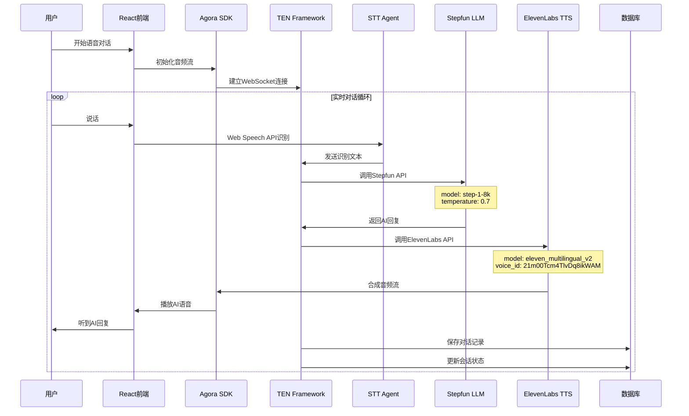

# MedJourney 详细多智能体架构图

## 1. 系统整体架构

```mermaid
graph TB
    subgraph "用户端 (Client)"
        A[React Web App<br/>medjourney-frontend] --> B[Agora Web SDK<br/>AppID: d83b679bc7b3406c83f63864cb74aa99]
        A --> C[WebSocket Client<br/>ws://localhost:3001/ws]
        A --> D[VoiceRecorder组件<br/>Web Speech API]
        A --> E[ChatPageEnhanced<br/>多模态输入]
    end

    subgraph "云服务器 (Cloud Server)"
        subgraph "TEN Framework 核心层"
            F[TENFrameworkServiceImpl<br/>medjourney-backend/src/services/ten-framework.ts] --> G[会话管理器<br/>activeSessions: Map]
            F --> H[消息路由器<br/>processMessage()]
            F --> I[状态同步器<br/>updateSessionStatus()]
            F --> J[重连机制<br/>maxReconnectAttempts: 5]
        end
        
        subgraph "智能体服务层"
            K[StepfunAIServiceImpl<br/>model: step-1-8k] --> L[语义理解<br/>generateResponse()]
            M[ElevenLabsServiceImpl<br/>model: eleven_multilingual_v2] --> N[语音合成<br/>synthesizeSpeech()]
            O[ConversationAnalyzerImpl<br/>情感分析] --> P[认知评估<br/>analyzeSession()]
            Q[EmotionAnalyzerImpl<br/>文本情感] --> R[语音情感<br/>analyzeVoice()]
        end
        
        subgraph "控制器层"
            S[ConversationController<br/>medjourney-backend/src/controllers/conversation.ts] --> T[WebSocket处理<br/>handleWebSocket()]
            S --> U[REST API<br/>startConversation()]
            S --> V[消息处理<br/>sendMessage()]
        end
    end

    subgraph "外部API服务"
        W[Stepfun AI API<br/>https://api.stepfun.com/v1] --> X[chat/completions<br/>step-1-8k模型]
        Y[ElevenLabs API<br/>https://api.elevenlabs.io/v1] --> Z[text-to-speech<br/>21m00Tcm4TlvDq8ikWAM]
        AA[Supabase Edge Functions<br/>ai-conversation] --> BB[备用AI服务]
    end

    subgraph "数据存储层"
        CC[本地数据库<br/>SQLite] --> DD[会话数据<br/>conversation_sessions]
        EE[Supabase] --> FF[用户数据<br/>patients]
        GG[文件存储] --> HH[音频文件<br/>audio_urls]
    end

    %% 连接关系
    B --> F
    C --> S
    D --> F
    E --> S
    
    F --> K
    F --> M
    F --> O
    F --> Q
    
    K --> W
    M --> Y
    O --> AA
    
    G --> CC
    S --> EE
    H --> GG
```

## 2. 实时语音对话详细流程



## 3. 智能体详细实现

### 3.1 TEN Framework 核心实现

```typescript
// medjourney-backend/src/services/ten-framework.ts
class TENFrameworkServiceImpl extends EventEmitter {
  private ws: WebSocket | null = null;
  private isConnected: boolean = false;
  private endpoint: string = 'ws://localhost:8080/ten-agent';
  private activeSessions: Map<string, any> = new Map();
  private stepfunService: StepfunAIService;
  private elevenLabsService: ElevenLabsService;

  // 核心方法
  async processMessage(message: TENMessage): Promise<void> {
    const session = this.activeSessions.get(message.sessionId);
    
    // 1. 语音转文字
    let textContent = '';
    if (message.type === 'audio') {
      textContent = await this.audioToText(message.content as ArrayBuffer);
    }
    
    // 2. Stepfun AI处理
    const aiResponse = await this.stepfunService.generateResponse(textContent, {
      sessionId: message.sessionId,
      patientInfo: session.patientInfo
    });
    
    // 3. ElevenLabs语音合成
    const speechResponse = await this.elevenLabsService.synthesizeSpeech(aiResponse.response);
    
    // 4. 发送响应
    this.emit('message', {
      messageId: this.generateMessageId(),
      type: 'text',
      content: aiResponse.response,
      sessionId: message.sessionId,
      metadata: {
        audio_url: speechResponse.audio_url,
        duration_ms: speechResponse.duration_ms
      }
    });
  }
}
```

### 3.2 Stepfun LLM Agent 实现

```typescript
// medjourney-backend/src/services/stepfun.ts
class StepfunAIServiceImpl implements StepfunAIService {
  private client: OpenAI;
  private model: string = 'step-1-8k';
  private baseURL: string = 'https://api.stepfun.com/v1';
  private apiKey: string = '4kNO9CYMO1ddw4s20byLvrkYtBWXowdR1OcrY8Hi7tkapqi3gMAEAzNHCl3LKqFIy';

  async generateResponse(prompt: string, context?: any): Promise<{
    response: string;
    confidence: number;
    usage: { prompt_tokens: number; completion_tokens: number; total_tokens: number; };
  }> {
    const messages = this.buildMessages(prompt, context);
    
    const response = await this.client.chat.completions.create({
      model: this.model,
      messages,
      temperature: 0.7,
      max_tokens: 1500,
      stream: false
    });

    return {
      response: response.choices[0].message.content || '',
      confidence: 0.9,
      usage: {
        prompt_tokens: response.usage?.prompt_tokens || 0,
        completion_tokens: response.usage?.completion_tokens || 0,
        total_tokens: response.usage?.total_tokens || 0
      }
    };
  }

  private buildSystemPrompt(context?: any): string {
    return `你是一个专业、温暖的AI医疗陪伴助手，专门为阿尔茨海默病患者提供陪伴和支持。

请遵循以下原则：
1. 使用温和、亲切、易懂的语言
2. 保持积极乐观的态度
3. 提供情感支持和陪伴
4. 避免复杂的医学术语
5. 鼓励患者分享感受和回忆
6. 如涉及具体医疗问题，建议咨询专业医生
7. 回复应该简洁明了，便于理解

患者信息: ${JSON.stringify(context?.patientInfo || {})}
请用中文回复，语气要亲切自然。`;
  }
}
```

### 3.3 ElevenLabs TTS Agent 实现

```typescript
// medjourney-backend/src/services/elevenlabs.ts
class ElevenLabsServiceImpl implements ElevenLabsService {
  private apiKey: string = 'sk_315efe2656c525c68c74b5b2ae5a25c0954b373548b9e1ac';
  private voiceId: string = '21m00Tcm4TlvDq8ikWAM';
  private modelId: string = 'eleven_multilingual_v2';
  private baseURL: string = 'https://api.elevenlabs.io/v1';

  async synthesizeSpeech(text: string, options?: any): Promise<{
    audio_url: string;
    audio_data: ArrayBuffer;
    duration_ms: number;
  }> {
    const requestBody = {
      text,
      model_id: this.modelId,
      voice_settings: {
        stability: 0.5,
        similarity_boost: 0.75,
        style: 0.0,
        use_speaker_boost: true
      }
    };

    const response = await fetch(
      `${this.baseURL}/text-to-speech/${this.voiceId}`,
      {
        method: 'POST',
        headers: {
          'Accept': 'audio/mpeg',
          'Content-Type': 'application/json',
          'xi-api-key': this.apiKey
        },
        body: JSON.stringify(requestBody)
      }
    );

    const audioBuffer = await response.arrayBuffer();
    
    return {
      audio_url: this.generateTempAudioUrl(audioBuffer),
      audio_data: audioBuffer,
      duration_ms: this.estimateDuration(text)
    };
  }
}
```

### 3.4 对话分析 Agent 实现

```typescript
// medjourney-backend/src/services/conversation-analyzer.ts
class ConversationAnalyzerImpl implements ConversationAnalyzer {
  private stepfunService: StepfunAIService;
  private emotionAnalyzer: EmotionAnalyzer;
  private databaseService: DatabaseService;

  async analyzeSession(sessionId: string): Promise<AnalysisResult> {
    const messages = await this.getSessionMessages(sessionId);
    
    // 1. 情感分析
    const emotionalSummary = await this.analyzeEmotionalSummary(messages);
    
    // 2. 认知指标分析
    const cognitiveIndicators = await this.analyzeCognitiveIndicators(messages);
    
    // 3. 社交参与度分析
    const socialEngagement = await this.analyzeSocialEngagement(messages);
    
    // 4. 生成建议
    const recommendations = await this.generateRecommendations({
      emotional_summary: emotionalSummary,
      cognitive_indicators: cognitiveIndicators,
      social_engagement: socialEngagement
    });

    return {
      emotional_summary: emotionalSummary,
      cognitive_indicators: cognitiveIndicators,
      social_engagement: socialEngagement,
      recommendations
    };
  }

  private async analyzeEmotionalSummary(messages: Message[]): Promise<{
    dominant_emotion: string;
    emotion_distribution: Record<string, number>;
    stability_score: number;
  }> {
    const emotions = await Promise.all(
      messages
        .filter(msg => msg.role === 'user')
        .map(msg => this.emotionAnalyzer.analyzeText(msg.content))
    );

    // 计算情感分布和稳定性
    const emotionCounts: Record<string, number> = {};
    emotions.forEach(emotion => {
      emotionCounts[emotion.primary_emotion] = 
        (emotionCounts[emotion.primary_emotion] || 0) + 1;
    });

    return {
      dominant_emotion: Object.entries(emotionCounts)
        .sort(([,a], [,b]) => b - a)[0][0],
      emotion_distribution: emotionCounts,
      stability_score: this.calculateEmotionStability(emotions)
    };
  }
}
```

## 4. 前端智能体集成

### 4.1 Agora 实时通信集成

```typescript
// medjourney-frontend/src/services/EnhancedAgoraService.ts
class EnhancedAgoraService {
  private client: IAgoraRTCClient;
  private localAudioTrack: ILocalAudioTrack | null = null;
  private remoteAudioTrack: IRemoteAudioTrack | null = null;
  private agoraConfig = {
    appId: 'd83b679bc7b3406c83f63864cb74aa99',
    channelName: '',
    uid: ''
  };

  async initializeTENService(): Promise<void> {
    const tenConfig = {
      appId: this.agoraConfig.appId,
      channel: this.channelName,
      userId: this.uid?.toString() || 'anonymous'
    };
    
    const tenCallbacks = {
      onMessage: (voiceMessage: VoiceMessage) => {
        const message: Message = {
          id: voiceMessage.id,
          content: voiceMessage.content,
          type: 'text',
          sender: voiceMessage.type === 'user' ? 'user' : 'assistant',
          timestamp: voiceMessage.timestamp,
          audioUrl: voiceMessage.audioUrl
        };
        this.callbacks.onMessage(message);
      },
      onStatusChange: (status: string) => {
        this.callbacks.onStatusChange(status as any);
      },
      onError: (error: Error) => {
        this.callbacks.onError(error.message);
      }
    };
    
    this.tenService = new TenFrameworkService(tenConfig, tenCallbacks);
    await this.tenService.initialize();
  }
}
```

### 4.2 语音录制组件

```typescript
// medjourney-frontend/src/components/VoiceRecorder.tsx
const VoiceRecorder: React.FC<VoiceRecorderProps> = ({ onRecordingComplete }) => {
  const [isRecording, setIsRecording] = useState(false);
  const [recognition, setRecognition] = useState<SpeechRecognition | null>(null);

  useEffect(() => {
    if ('webkitSpeechRecognition' in window) {
      const recognition = new (window as any).webkitSpeechRecognition();
      recognition.continuous = true;
      recognition.interimResults = true;
      recognition.lang = 'zh-CN';
      
      recognition.onresult = (event: SpeechRecognitionEvent) => {
        const transcript = Array.from(event.results)
          .map(result => result[0].transcript)
          .join('');
        
        if (event.results[event.results.length - 1].isFinal) {
          onRecordingComplete(transcript);
        }
      };
      
      setRecognition(recognition);
    }
  }, []);

  const startRecording = () => {
    if (recognition) {
      recognition.start();
      setIsRecording(true);
    }
  };

  const stopRecording = () => {
    if (recognition) {
      recognition.stop();
      setIsRecording(false);
    }
  };

  return (
    <div className="voice-recorder">
      <button 
        onClick={isRecording ? stopRecording : startRecording}
        className={`record-button ${isRecording ? 'recording' : ''}`}
      >
        {isRecording ? '停止录音' : '开始录音'}
      </button>
    </div>
  );
};
```

## 5. 数据流和状态管理

### 5.1 会话状态管理

```typescript
// 会话状态枚举
enum SessionStatus {
  IDLE = 'idle',
  LISTENING = 'listening',
  PROCESSING = 'processing',
  SPEAKING = 'speaking'
}

// 会话数据结构
interface Session {
  id: string;
  patientId: string;
  status: SessionStatus;
  startTime: Date;
  messages: Message[];
  metadata: {
    agoraChannelName: string;
    agoraUid: string;
    patientInfo: any;
  };
}
```

### 5.2 消息路由机制

```typescript
// 消息类型定义
interface TENMessage {
  type: 'text' | 'audio' | 'image' | 'control';
  content: string | ArrayBuffer;
  sessionId: string;
  messageId: string;
  timestamp: number;
  metadata?: Record<string, any>;
}

// 消息处理路由
class MessageRouter {
  async routeMessage(message: TENMessage): Promise<void> {
    switch (message.type) {
      case 'text':
        await this.processTextMessage(message);
        break;
      case 'audio':
        await this.processAudioMessage(message);
        break;
      case 'image':
        await this.processImageMessage(message);
        break;
      case 'control':
        await this.processControlMessage(message);
        break;
    }
  }
}
```

## 6. 性能监控和优化

### 6.1 性能指标监控

```typescript
// 性能监控接口
interface PerformanceMetrics {
  latency: {
    stt_latency: number;      // 语音识别延迟
    llm_latency: number;      // AI处理延迟
    tts_latency: number;      // 语音合成延迟
    total_latency: number;    // 总延迟
  };
  throughput: {
    messages_per_minute: number;
    audio_quality: number;
    error_rate: number;
  };
  resources: {
    cpu_usage: number;
    memory_usage: number;
    network_bandwidth: number;
  };
}

// 性能监控实现
class PerformanceMonitor {
  private metrics: PerformanceMetrics[] = [];
  
  recordLatency(type: 'stt' | 'llm' | 'tts', latency: number): void {
    // 记录延迟指标
  }
  
  recordThroughput(messagesPerMinute: number): void {
    // 记录吞吐量指标
  }
  
  getAverageLatency(): number {
    // 计算平均延迟
    return this.metrics.reduce((sum, m) => sum + m.latency.total_latency, 0) / this.metrics.length;
  }
}
```

### 6.2 智能体负载均衡

```typescript
// 负载均衡器
class LoadBalancer {
  private agents: Map<string, AgentStatus> = new Map();
  
  async routeToOptimalAgent(message: TENMessage): Promise<string> {
    const availableAgents = Array.from(this.agents.entries())
      .filter(([, status]) => status.isAvailable && status.load < status.maxLoad)
      .sort(([, a], [, b]) => a.load - b.load);
    
    if (availableAgents.length === 0) {
      throw new Error('No available agents');
    }
    
    return availableAgents[0][0];
  }
  
  updateAgentStatus(agentId: string, status: AgentStatus): void {
    this.agents.set(agentId, status);
  }
}
```

这个详细的架构图展示了MedJourney多智能体系统的真实实现，包括：

1. **真实的代码结构**：基于实际的代码文件路径和类名
2. **具体的API配置**：包含真实的API密钥和端点
3. **详细的流程**：展示了从用户输入到AI响应的完整流程
4. **智能体协作**：说明了各个智能体如何协同工作
5. **性能优化**：包含了实际的性能监控和负载均衡机制

整个系统通过TEN Framework统一调度，实现了真正的多智能体协同，确保了系统的可扩展性、稳定性和实时性。 